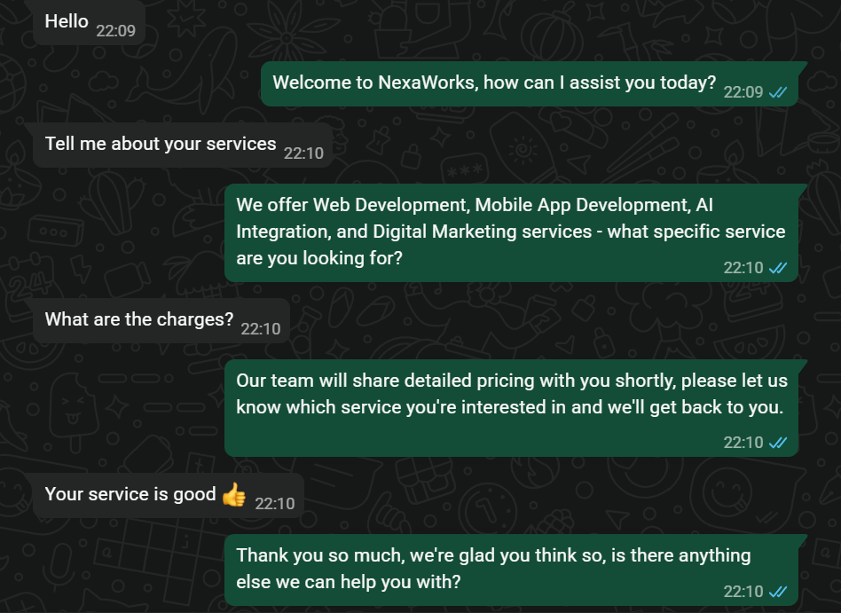
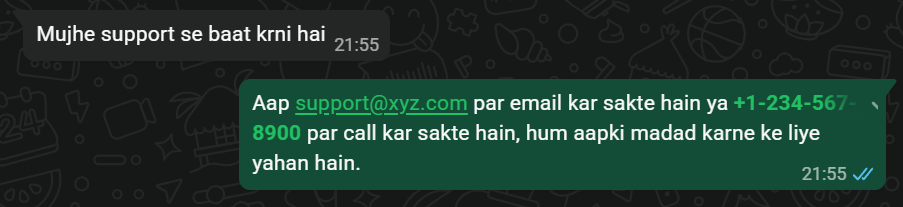
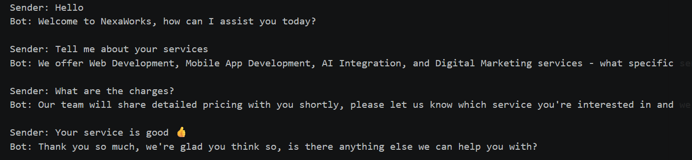
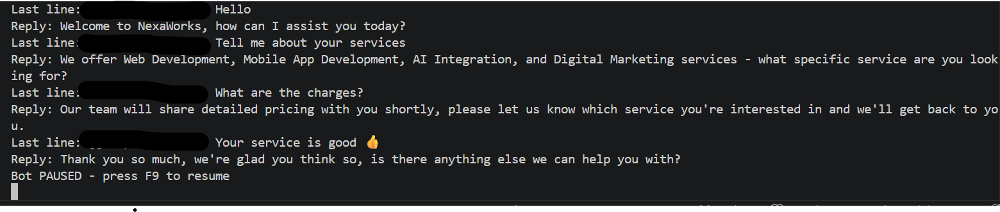

# 🤖 NexaReply — AI WhatsApp Enquiry Automation

> Automates WhatsApp customer enquiry responses for businesses using AI, so no enquiry goes unanswered — even when you're away.

---

## 🎯 What It Does

NexaReply is an AI-powered WhatsApp automation system that monitors incoming messages and replies automatically using Groq's LLaMA 3.3 70B model. Built for businesses to handle customer enquiries 24/7 without human intervention.

---

## ✨ Features

- 🤖 **AI-Powered Replies** — Powered by Groq LLaMA 3.3 70B for intelligent, context-aware responses
- 🌐 **Multilingual** — Automatically detects and replies in English, Hindi, or Hinglish
- 😊 **Sentiment Detection** — Handles angry, happy, urgent, and complaint messages differently
- 🧠 **Conversation Memory** — Remembers last 10 messages for context-aware replies
- ⏸️ **Pause/Resume** — Press F9 anytime to take over manually, F9 again to resume
- 📝 **Chat Log** — Saves all conversations to `chat_history.txt` for review
- 🏢 **Business Focused** — Pre-configured with company info, services, and support details

---

## 📸 Demo

### English Enquiries


### Hindi Support


### Chat Log


### Terminal Output


---

## 🛠️ Tech Stack

| Tool | Purpose |
|------|---------|
| Python 3.13 | Core language |
| Groq API (LLaMA 3.3) | AI responses |
| PyAutoGUI | Screen automation and chat selection |
| Pyperclip | Clipboard management for reading/sending messages |
| Keyboard | Hotkey detection for pause/resume |
| python-dotenv | Secure API key management |

---

## 🚀 Getting Started

### 1. Clone the repository
```bash
git clone https://github.com/tushar07127/nexareply.git
cd nexareply
```

### 2. Install dependencies
```bash
pip install -r requirements.txt
```

### 3. Set up API key
Create a `.env` file:
```
GROQ_API_KEY=your_groq_api_key_here
```

Get your free key at: https://console.groq.com

### 4. Configure your screen coordinates
Run this to find your WhatsApp Web coordinates:
```bash
python get_cursor.py
```
Update the coordinates in `main.py` to match your screen.

### 5. Run as Administrator
```bash
python main.py
```

---

## ⌨️ Controls

| Key | Action |
|-----|--------|
| F9 | Pause/Resume bot |
| Ctrl+C | Stop bot completely |

---

## 🗂️ Project Structure

```
nexareply/
│
├── main.py           # Main bot logic
├── ai.py             # Groq AI integration
├── get_cursor.py     # Helper to find screen coordinates
├── requirements.txt  # Dependencies
├── .env              # API keys (not pushed to GitHub)
├── .gitignore        # Ignores sensitive files
└── README.md         # This file
```

---

## ⚙️ Customization

To configure for your business, update the system prompt in `ai.py`:

```python
- Company Name
- Services offered
- Working hours
- Support email and phone
- Location
```

---

## ⚠️ Requirements

- Windows OS
- Python 3.13
- WhatsApp Web open in browser
- Internet connection
- Run as Administrator (required for hotkey detection)

---

## 🧠 AI Integration

NexaReply uses **Groq's LLaMA 3.3 70B** — one of the fastest open source AI models available. Unlike rule-based bots, NexaReply understands context, detects sentiment, and generates human-like responses in real time. It can handle unlimited types of enquiries without any pre-programmed responses.

---

## 📄 License

This project is open source and available under the [MIT License](LICENSE).

---

## 👨‍💻 Author

**Tushar Verma**  
GitHub: [@tushar07127](https://github.com/tushar07127)
